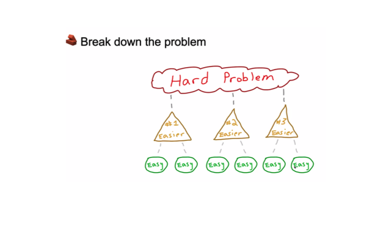
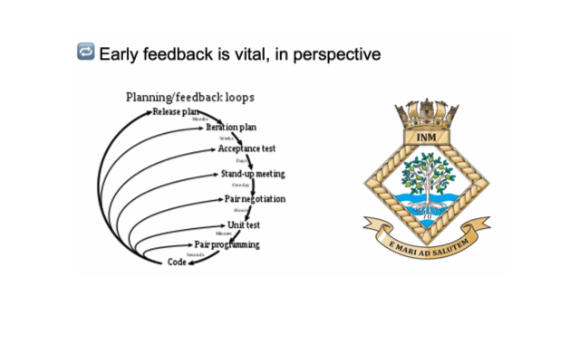

**Morning**

- Chris Meah (CEO) Introduction to the School of Code.

  'Your imagination is the limit in what you can do with code' - Chris Meah.

- Team SOC Bootcamp 13
  

- Hero Path

- National Bootcamp Curriculum:

  1.- Intro to the School of Code way - Computational Thinking and Problem Solving with JavaScript.

  2.- Fundamentals of programming with JavaScript - Getting up to speed with the JavaScript Language and interacting with APIs.

  3.- Creating applications with the user in mind - User-driven design, UI/UX, and an introduction to Agile.
  4.- The world of server-side programming - Creating APIs, learning NodeJS, and communicating with data.
  5.- Databases and Conventions - Databases, SQL, and RESTful APIs.

  6.- Robust code in systems - Testing and modern software engineering practices.

  7.- Component-based thinking and frameworks - React introduction and advanced user interfaces.

  8.- Developing good, user-centric products in teams - Deeper dive into React, agile project management, and great user experiences.

  9.- Real-world project week.

  10.- Retrospectives and deployment - Learning from project experiences and Agile best practices, plus deploying projects with the cloud.
  
  - Active recruitment prep - getting ready with everything you'll need to join the recruitment process at the end of the course.

  11.-12.- Adding depth to understanding - Going deeper into advanced computer science and software engineering concepts.

  13.- Start of the four-week final project - Working in teams and layering in more knowledge and skills through targeted sessions.

  12.-
  13.-
  16.- Final projects finish - You'll have created your best work yet, and have learned a lot along the way.

  17.- Career Launchpad - Presenting final projects to employers and support from the recruitment team into interviews and job roles, alongside support from the coaching team and fellow boot campers to continue your learning.

  18.- For Life: School of Code Community - You'll have made friends for life, gained a professional network that would've taken a lifetime to build, and you'll be part of the most supportive community around!

- How is this path different from other Bootcamps/University/Self-taught Paths?
  

- You need to be a learning athlete

  1.- Focus.
  2.- Healthy body, healthy mind, great learning.
  3.- Humility.
  4.- Motivation.
  5.- Resilience.

**Exercises**

_Haiku_
Soc magnificent?
Chris Meah asserts exactly?!
So does the SoC team!

_[Css Selectors](https://flukeout.github.io)_

- Working in pairs through Css selector practice.

- A deeper understanding of How to communicate and solve problems as part of a team.

**Evening**

- How to solve problems the SOC way:

  1.- Understand the problem
  Team question: 'Why is this important?'
  Team answer: 'To have a deeper understand of the root of the cause and think different angles about how to solve them'
  2.Breaking down the problem
  Team question: 'Why is this important?'
  Team answer: 'Is easier to break in little parts to tackle the attack'
  

  3.- Looking for patterns
  Team question: 'Why is this important?'
  Team answer: 'Predict what can happen and develop a faster solution for problems

  4.- Model Real world
  Team question: 'Why is this important?'
  Team answer: 'How: Variables, can be taken from the real world.
  Why: To prevent or solve a problem or improve a solution.'

  5.- Algorithm
  Team question: 'Why is this important?'
  Team answer: 'A step-by-step procedure for solving a problem or accomplishing some end.

  An algorithm gives the computer a specific set of instructions, allowing it to do everything, from running a calculator to landing on the moon.'

  6.- Program the solution

- A guide to SOC thinking once a week

  1.- Feedback
  Team question: 'Why is this important?'
  Team answer: ' Feedback is the best way to keep on track of tasks critical to advance and improve.'

  

  2.- Trade-offs and Critical Thinking
  [File transfer time calculator](https://www.expedient.com/knowledgebase/tools-and-calculators/file-transfer-time-calculator/)

  3.- Self Management

  4.- Effective Teams - Cognitive Diversity - Comfortable being uncomfortable - Learning how to learn

**Exercise**

1.  Write a letter to yourself six months after completing SOC (26/09/2022).

        Congratulations! for finishing the journey that you committed to not long ago.

        It has been a challenging path but a great experience to meet wonderful people that will change your life.

        I can not wait to hear all the histories, memories and anecdotes you will have to tell me and please do not omit anything I have time.

        Sincerely yours,

        Julio Velezmoro

2.  Write a letter Pre-mortem

    - Improve my communication skills.
    - Balance my life.

**Team pairs:**
_[Evgenii](https://github.com/itsevgenii)_

- What did you do before School of Code?

  International commercial shipping industry.

- What is your favourite type of food?

  Turkish Breakfast and Sourdough Pizza.

- If you had to listen to 1 song for the rest of your life,
  what would it be?

- How many siblings do you have?

- What did you want to be when you were a child?

- Do you like surprises?

- What are your hobbies?
  Hiking, Friday out, going to the gym, he used to play the piano, we were thinking of forming a band.

  Is anyone up for it? 🎸🎹

- Where is the furthest away from home you have been?

- If you could pick a time in history to visit, when would it be?
