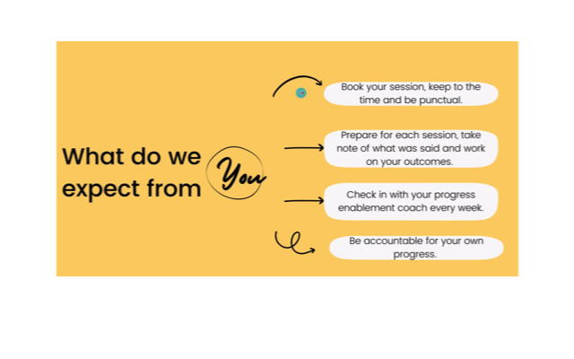
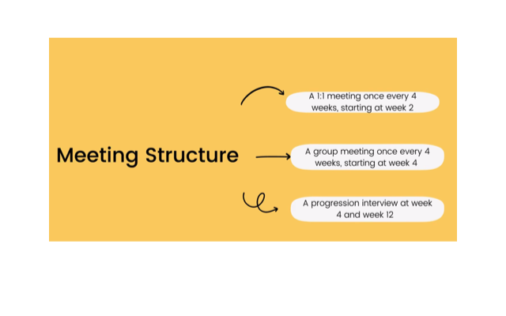
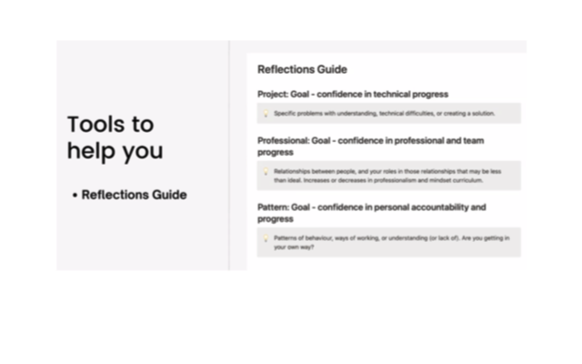
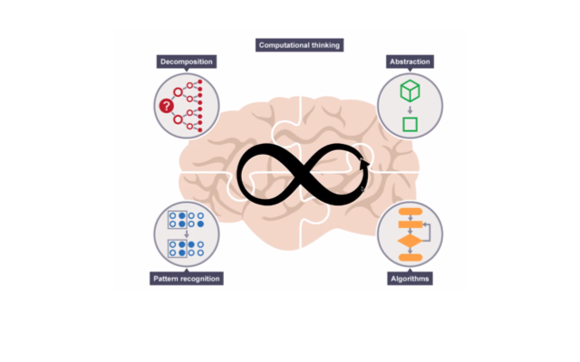
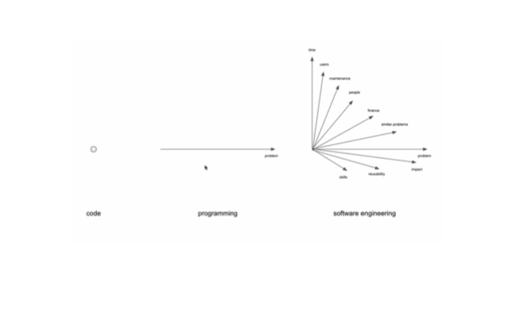
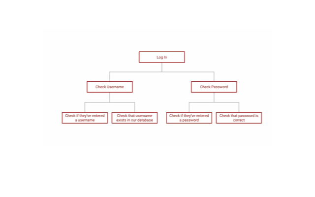
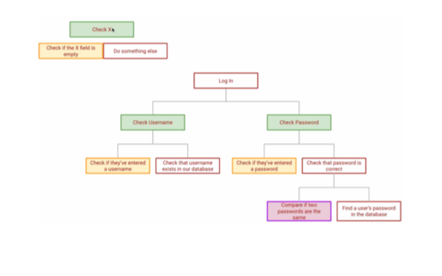
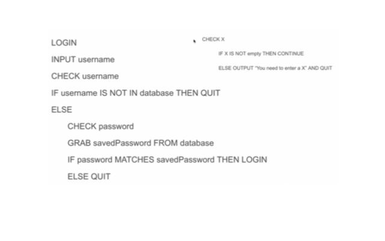
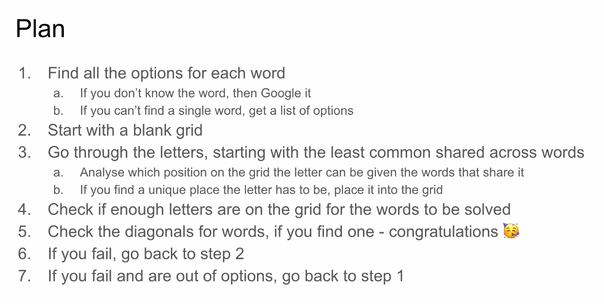
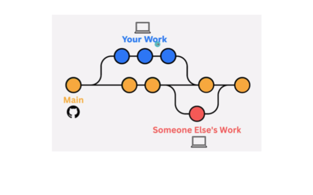

**Morning**

**Enablement Coaches**
 
    Vicky Meah
    Rikiah Williams
    Jessica Roach

Meeting structure

**Team:**
_[Francesco]()_
_[Dionne]()_
_[Amina]()_
- Most uncomun thing we have in comun?

 We found out that we all speak Italian, English and Spanish.

**Team A**

- Coach: Hanza Ibrahim

**Computational thinking**

Think > Plan > Solve

**Examples**

**Team _[Evgenii](https://github.com/itsevgenii)_ Exercises**
0. _[MakingTe]_
1. _[SpacePack]_
2. _[Deduction]_
3. _[MakingSpace]_

Thoughts: Great Exercises to practice problem-solving skills. I could not complete them at first but slowly got to the answers.

**Evening**

- Git and GitHub by Liz

- Liz guided us through the git-demo file and sent us a cheat sheet.

**Team _[Evgenii](https://github.com/itsevgenii)_ Exercises**

- Create a group on GitHub-SOC.
- Join group GitHub-SOC.
- Copy repository locally.
- Update .md file, taking turns to complete a poem. We also did a small chat with fav movies and series.