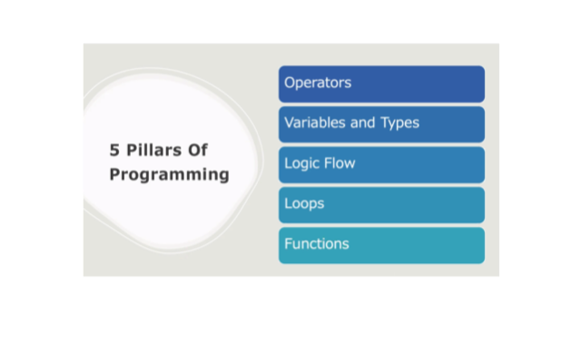
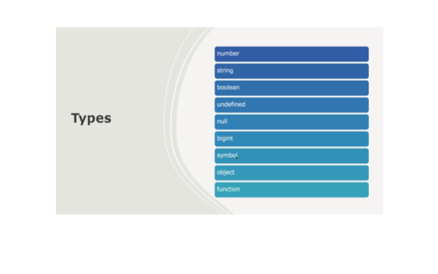
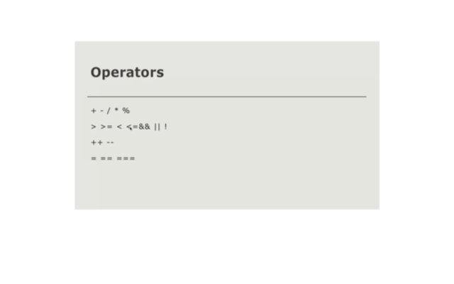
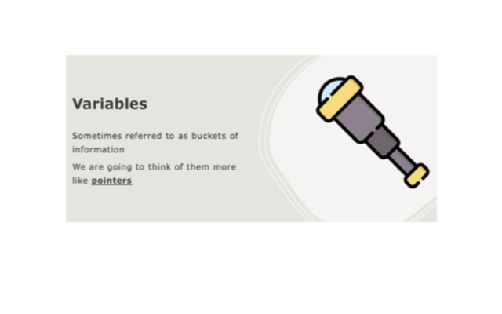
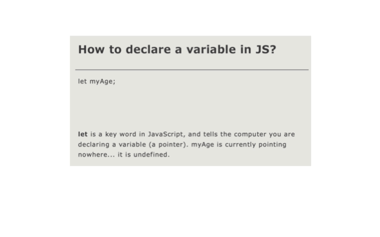

***Morning Quiz**

**Quiz 1**
- SCORE: 8/8 

**Break Room**
 
 **Team**
 Jason
 Daniel
 Fabbiha

**LEARNING TO SPEAK COMPUTER**

 - Think like a Computer.
 - Simplified complex thing.
 - Programming Languages.

**JavaScript**
_[Rap](https://www.youtube.com/watch?v=t8eQjr9JGM8)_

 
 

 - Undifined = 'Not value added' 
 - Null = 'Value of nothing'
 - Object
 - Functions

 
 
 
 
 In JavaScript ' = ' is the Pointer symbol.

 Js and Vscode Exercise

 Team Exercises 

 **Evennig**

 - Functions

 - Energize winner was Martha

**TeamGroups**

- js1
- js2