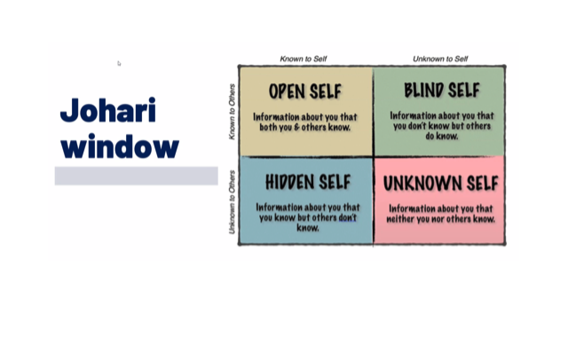
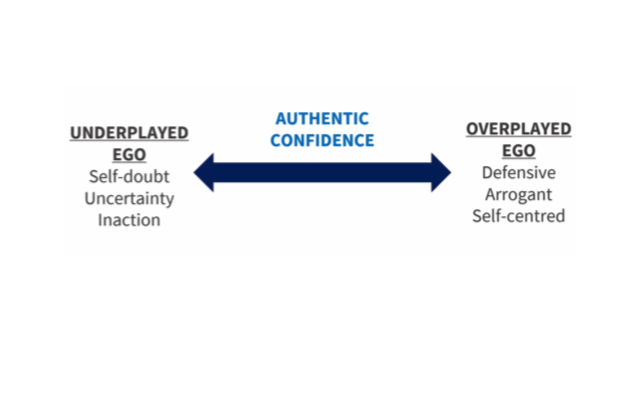
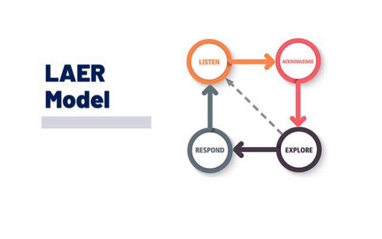
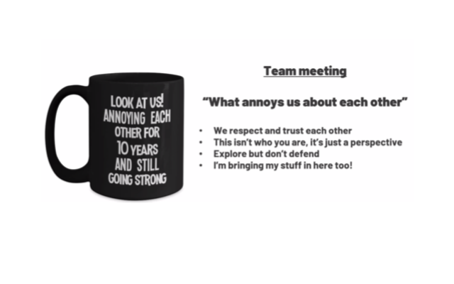
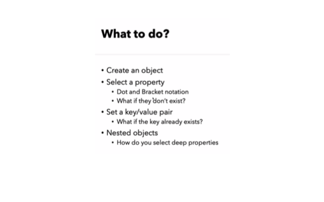
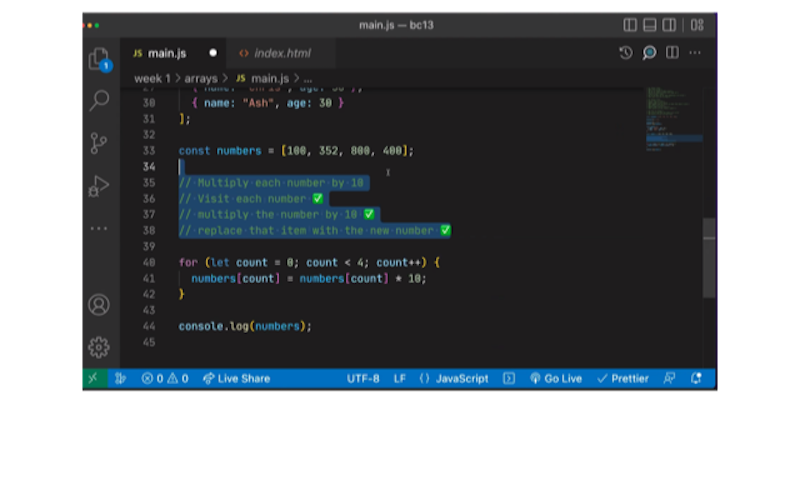

**Morning**

- Quiz JS (6/8) [Function no returned is undifined, I miss one for not reading properly]

- Spearker: Joseph Trodden
    - Talk about the importance feedbacks.

    - Johari window
     

    
    - Article opinion: Benjamin Puusta
    "
        interesting... so if i understand correctly, the article argues that feedback, if you're only using yourself as a template, can miss the mark on what works well for others.  I suppose if you create this theory of excellence, it can be end up being more prescriptive EG -' you must be this way', rather than 'finding what works best for you alongside the rest of us'             
    "

    - More documentation [Human Learning](https://www.humanlearning.systems/)
     

    - LAER model
     

    - Activity PERSONAL GUIDELINES FOR SEEKING & RECEIVING FEEDBAC

        - Aim to assist

        - Actionable

        - Appreciate
        
        - Accept or Discard
        
    - Activity Own principles for giving feedback
        
        - Insightful

        - Collaborative

        - Actionable

        - Timely

    - Task for mindset session:

        **Giving feedback**

        - Do you understand other people perspective?

        - Is the feedback two ways conversation?

        - Is your feedback constructly?

        - Apropiate timming and situation?

        - Does it offer solutions?

        - Start in a possitive tone?

        - Actionable plan in place?

        - Is it Fair and Honest?

        **Receiving feedback**

        - Be open to look thing in a different way.

        - Stay courious.

        - Don not let your ego mess with you.

    
    

- Recap Fast-forward
    
    - Casing: Camel(variables), Snake, Kebab, Pascal, ScreammingSnake(used as Const on js).

    - Variables: let, const and we are not going to use VAR.

    - Strigns: `${}` Was introduce as string interpolation.

- Creating Objects and nested Objects

- Arrays

 